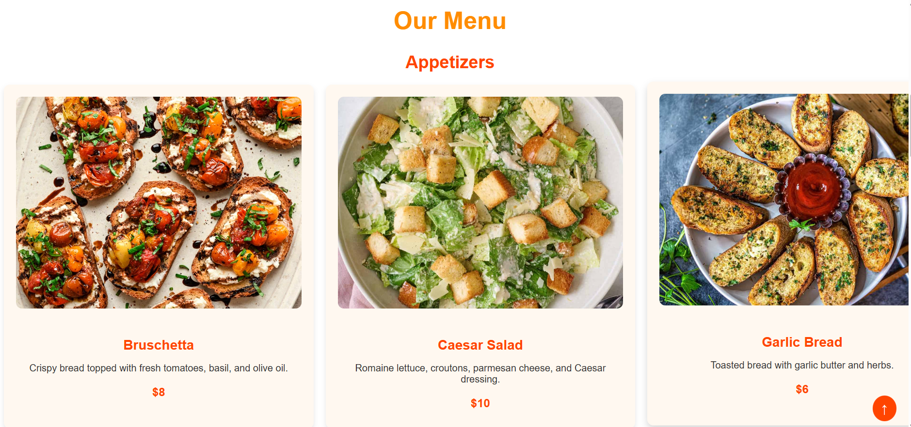

# 🍽️ Foody - Restaurant Website

Welcome to **Foody**, a modern and responsive restaurant website built with **HTML**, **CSS**, **JavaScript** and **Flask**. 

This project showcases a clean and elegant design, featuring sections for **🔐 LogIn**, **📝 Registration**, **ℹ️ About Us**, **🍔 Menu**, **📞 Contact Us**, **📍 Location**, **🎉 Special Offers**, and **💬 Testimonials**.

## 📌 Registration Page


## 🔐 Login Page


## ℹ️ About Us


## 🥗 Appetizers


## 🍽️ Main Courses


## 🍰 Desserts


## 🎁 Offers & Feedback


## 📞 Contact Us


## ✨ Features

- **🔐 User Authentication**: Secure login and registration system using Flask and SQLite.
- **📱 Responsive Design**: The website is fully responsive and works seamlessly on all devices.
- **🍽️ Interactive Menu**: Displays appetizers, main courses, and desserts in a clean, grid-based layout.
- **📩 Contact Form**: Allows users to send messages directly from the website.
- **🗺️ Google Maps Integration**: Displays the restaurant's location using an embedded Google Map.
- **🎠 Carousel**: A rotating image carousel in the **About Us** section.
- **✨ Hover Effects**: Interactive hover effects on menu items and buttons.
- **💎 Modern Glassmorphism UI Design**: The registration and sign-up pages feature a sleek, frosted-glass effect.

## 🛠️ Technologies Used

- **HTML5**: For structuring the website.
- **CSS3**: For styling and layout.
- **JavaScript**: For interactivity (e.g., carousel, form submission).
- **Flask**: For backend development and server-side logic.
- **SQLite**: For managing the database and storing user information.
- **Google Maps API**: For displaying the restaurant's location.


## 🎥 Demo

Here’s a quick demo of the **Foody** app:

[](video_link)


## 🚀 Setup Instructions

1. Clone the repository:
   ```sh
   git clone https://github.com/LasithaAmarasinghe/Foody.git
   ```
2. Navigate to the project directory:
   ```sh
   cd Foody
   ```
3. Install dependencies:
   ```sh
   pip install -r requirements.txt
   ```
4. Run the Flask application:
   ```sh
   python app.py
   ```
5. Open 🌍 `http://127.0.0.1:5000/` in your browser to access the website. 🍽️🔥
